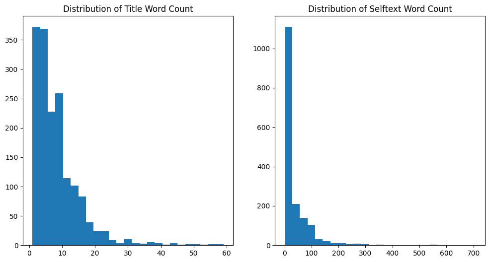
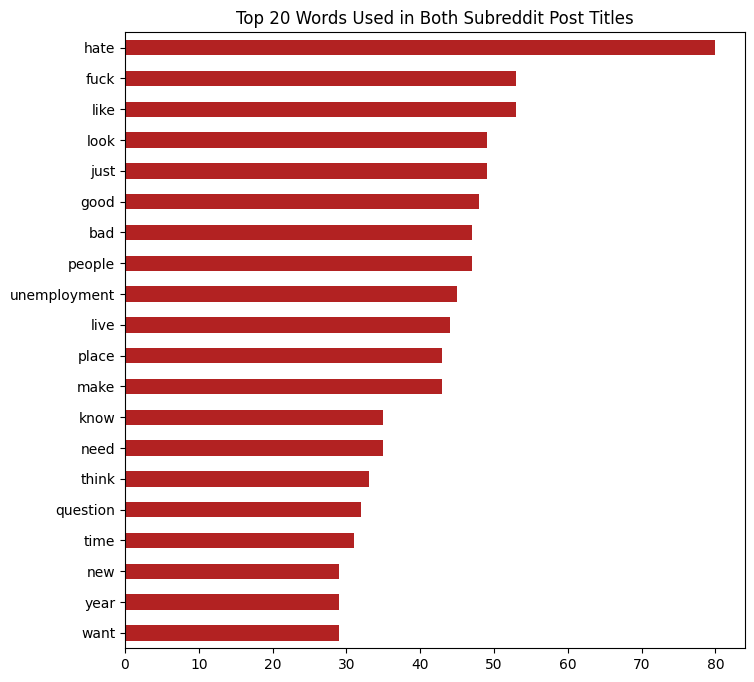
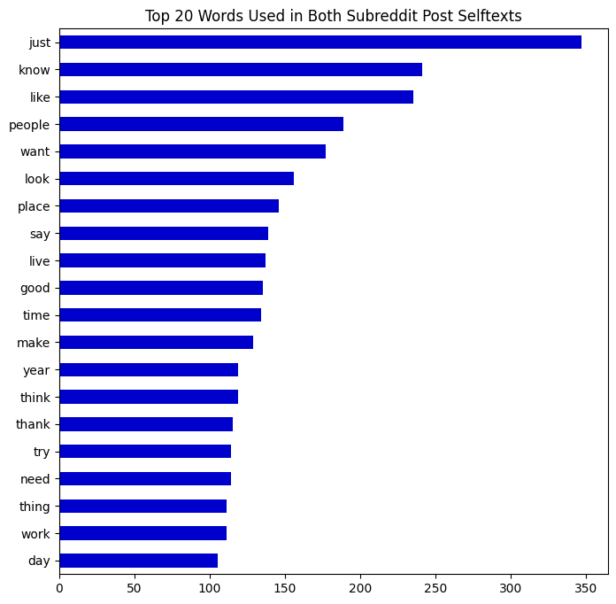
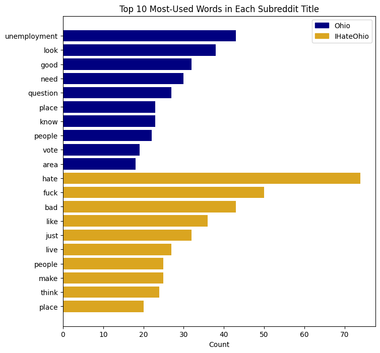
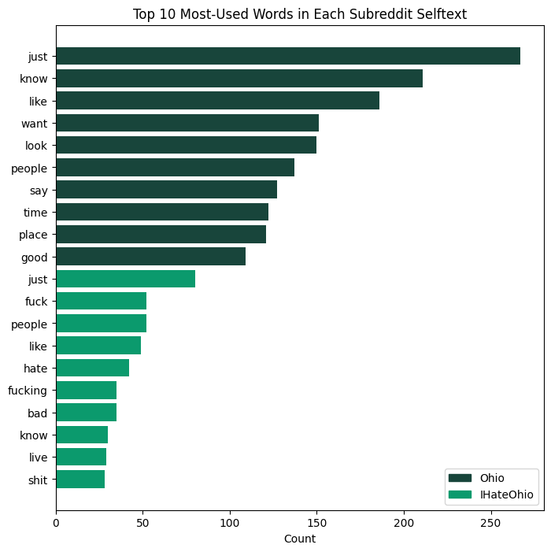
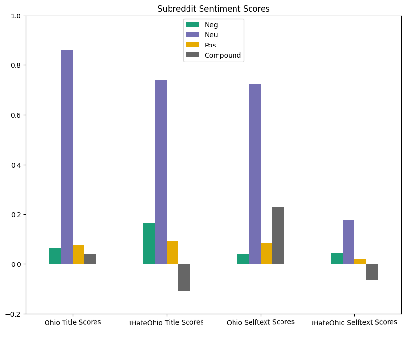
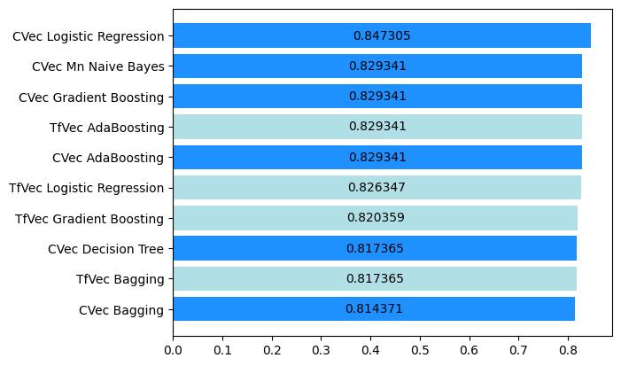

# Destination - Ohio

### Contents:
- [Problem Statement](#Problem-Statement)
- [Executive Summary](#Executive-Summary)
- [Conclusions and Recommendations](#Conclusions-and-Recommendations)

### Problem Statement

I work for [TourismOhio](https://ohio.org/home/about-us), where our mission statement is to “aggressively position Ohio as a relevant travel destination and support Ohio’s tourism industry to drive economic prosperity throughout the state.” We saw a 21% drop in visitor spending in 2020, but rebounded in 2021, and we are now trying to continue the growth momentum with more relevant ads and offers.

To do this, I’ve first been asked to scrape social media sites and find out what people are saying about our state and why they may or may not visit so that we can adapt our advertisements to our target audiences. I am starting on Reddit, with what I believe to be two relevant subreddit pages:
- Ohio: Created on October 4, 2008, with 342k members
- IHateOhio: Created on September 28, 2018, with 4.6k members

Before I can analyze the messages or make any recommendations, I need to be able to pull posts from each of these threads into an aggregated data frame. My goal is to build a classification model that can predict, with at least 85% accuracy, which subreddit each post is from.

### Executive Summary

The first **[01-initial-scraping.ipynb](code/01-initial-scraping.ipynb)** notebook begins by using the pushshift api to import posts from both subreddit threads as separate dataframes.

**Note: There are two versions of this project and analysis - one in which URLs were deleted from all posts in the dataset, and one in which they were not. All results mentioned below are based on the dataset that had URLs extracted. The second set of models and results are located in the appendix files located in the 'code' folder.**

All cleaning and EDA takes place in the **[02-eda-and-preprocessing.ipynb](code/02-eda-and-preprocessing.ipynb)** notebook. Here, we start by extracting only the features that will be used in analysis; in this case, subreddit (as the target), post title, post selftext, and author. We removed all nulls in these remaining columns, and dropped any rows that contained URLs in the title or selftext strings. We also engineered two additional feature columns: title word count and selftext word count. Below we see a distribution of the two variables, which both look to be heavily skewed.

After further EDA, we find that the average title length among the two subreddits are close in number, but the mean word count of the selftexts in the Ohio posts is almost 6x greater than the IHateOhio mean. Below are the 20 most-used words in titles of the combined dataframe:

The 20 most common words in the subreddit threads' selftext:

These are the 10 most frequent words in each subreddit title:

And the 10 most-used words in each of the subreddits' selftexts:

Finally, we examined the mean sentiment scores for both subreddit title and selftext sections.

From this, we can see that the greatest mean for all four is the neutrality score.

The IHateOhio post titles have the lowest mean compound score, at almost -0.10 and the Ohio selftexts have a strong mean of 0.24. All compound score standard deviations are 0.27 or above, meaning that these scores can vary quite a bit and depending on how they vary, could make it easier or harder for the models to classify.

In the **[03-model-building.ipynb](code/03-model-building.ipynb)** notebook, we established the baseline score of 0.522, and built a function that will take in a predefined pipeline as an argument, and output the train and test scores, accuracy and misclassification rates, and a confusion matrix showing the predictions of the best scoring model.

I wanted to include as little bias as possible, so I used both CountVectorizer and TfidfVectorizer for each model and included almost no hyperparameters. I also tested on the title and selftext columns to determine which was the most effective X variable. What we found is that my previous hypothesis was incorrect; selftext outperformed title as X in all but two models.

Our best model was the CountVectorizer Logistic Regression model. The mean accuracy across all models was 0.752, and the maximum score was 0.847. These scores do not meet our desired threshold of 0.85.

Because we had a confusion matrix for all models, we were able to identify a pattern in where the misclassifications were occurring for most models. To look into this further, we analyzed the misclassified posts for five different models and filtered to only the posts that showed up three or more times. A summary of what we were able to glean from the results:
- Empty strings and anything written in a different language are too vague for the model to interpret and are defaulted to the majority class.
- Context is important, but it's not something the models are particularly adept at picking up on. For example, a post like "I love to talk about how terrible Ohio is" will be classified as being from the Ohio subreddit because the computer is seeing the word "love" but missing the meaning of the post as a whole.
- Posts that contain locations are very often misclassified. My theory is that mentions of state names or Ohio city names are more common in the Ohio subreddit, which results in a high likelihood of misclassification when these appear in the IHateOhio subreddit.

Moving into model trials with hyperparameter tuning, these were the original best-performing models that will be tested first:

In the **[04-model-tuning.ipynb](code/04-model-tuning.ipynb)** notebook, we built another function that will grid search over several hyperparameters in the models, and this time output the best parameters, highest cross-val, train, and test scores, lowest misclassification rate, and again, a confusion matrix for the best model.

We did also perform a bit of inference, but were not able to pull much useful information from the log coefficients. The main interpretation we were able to make is that using the word 'ohio' in the selftext of a post is a likely predictor that this observation will be classified in the IHateOhio subreddit.  As expected, we also saw quite a few more negative and expletive words like 'hate,' 'bad,' and 'hell' in the important IHateOhio features.

Many of the models scored lower with hyperparameters than without. We also found that the previous top-performing model, Logistic Regression, was surpassed by both Multinomial Naive Bayes and GradientBoosting models.

We tried three versions of stacked models with what we thought would be good combinations of models that had performed well. Two of the three did get scores over 0.85, but in all, none of the stacked models scored higher than the previous MNB trial.

### Conclusions and Recommendations

The final overall model to move forward with in my classification tasks for the state of Ohio is the MNB Classifier, using CountVectorizer, a max document frequency of 0.7, max features set to 3,000,  a minimum document frequency of 1, and the MNB alpha set to 0.5.

MNB and Logistic Regression both consistently scored well compared to the other models, with and without hyperparameters. I think one reason why MNB edged forward after model tuning is that it is a generative model (as opposed to LogReg, which is a discriminative model). This means that in general, MNB needs less data to train versus LR, and is more biased toward feature independence.

Something to note is that most of the models before and after tuning are overfit. Even with Bagging and Boosting, the average difference between the train and test scores here was about 0.07. While not dramatically different, this is still a greater gap than I'd want there to be when modeling in the real world.

However, the scores with grid-searched hyperparameters did become more consistent. The standard deviation of 0.0178 tells us that we can reasonably expect an average score of 0.8238, within a +/- 0.0178 margin.

I was surprised at a few of the models that did not score as well as the no-parameter versions. I think this is probably in part due to user error - I may not be entering the most optimal values into the pipelines, and the models may be scoring as high as they can with what I'm feeding into them. I also think that very intelligent people created the models to begin with, and have programmed the default hyperparameters to be the values that work the best on most sets of data.

Overall, I'm happy with the scores of the tuned models, and I have at least one that could reliably be used to classify posts correctly 85% of the time. However, I would call into question the value of the data that is being pulled. We may have working models, but this is irrelevant if we are looking for information in the wrong place. From what I've seen during EDA, model trials, inference, and just looking through many of the posts directly in the dataframe, Reddit does not appear to be a site where people go to share things that they enjoy about Ohio. There are many people who share their dislikes, but very few have to do with anything that our advertising team can fix or market to. To this end, not all of the objectives of my problem statement were attained, as I can not confidently say that we would be able to use the scraped data as guidance for our team.

The next steps I would take are:
- Pulling data out of websites like TripAdvisor or Yelp, where people are reviewing specific places or experiences in Ohio.
- Clean and preprocess the data further e.g. include lemmatizers in the model trials and add in more custom stop words.
- Make sure to investigate the misclassified posts. Based on what we saw with these results, I think there are sometimes patterns that can be identified and accounted for in the model.
- Further model trials and testing; running with additional hyperparameters. Focus on decreasing variance.
- After all of the above, implementation of the best-scoring model to pull out any notable material that is being said about Ohio on more review-based websites, then advising our marketing team to mention or not mention said points in our ads.
